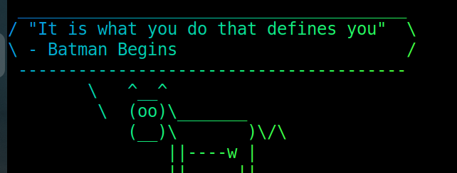

Random quotes selection and display

## Installation
1. Installation of fortune
```
curl -sL https://swee.codes/repo.sh | sudo bash
sudo apt install fortune
```
2. Installation of cowsay
```
npm install -g cowsay
```
3. Installation of lolcat
```
sudo apt install lolcat
```
## Usage
1. To display quotes 
```
fortune /path/to/quotes | cowsay -r| lolcat
```
2. Add quotes in "quotes" file . line seperated by '%'
```
"It is what you do that defines you"
- Batman Begins
%
"Whatever comes our way, whatever battle
we have raging inside of us, we always
have a choice. It is our choices that
makes us who we are, and we always have
 a choice to do what's right"
 ― Spiderman
%
"You either die a hero or live long
 enough to see yourself
become the villain"
- Batman: Dark Knight
```
3. Compiling quotes to dat file 
```
strfile -c % quotes quotes.dat
```
4. Sample image of how it looks and feels like
<p>

</p>

### Credits
1. Inspiration from [@ThorodanBrom](https://github.com/ThorodanBrom) and [@shreelakshmijoshi](https://github.com/shreelakshmijoshi)
